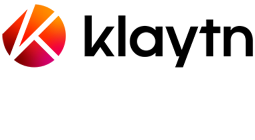

# Klaytn Remix Plugin

`plug-and-klay` is the "DEPLOY & RUN TRANSACTIONS" plugin of [Klaytn](https://klaytn.com) which is EVM based global public blockchain project.

As the official [Klaytn DevTools partner](https://medium.com/klaytn/klaytns-new-devtools-partnership-announcement-70ebcb992638), [OZYS](https://ozys.io) provides this plugin as well as [Klaytnscope](https://scope.klaytn.com) which is the official block explorer of the Klaytn chain.

# Differentiation from the Ethereum plugin

Klaytn has its browser plugin "[Kaikas](https://chrome.google.com/webstore/detail/kaikas/jblndlipeogpafnldhgmapagcccfchpi)"( similar to Metamask ).
and Klaytn provides fee-delegated transaction types unlike Ethereum (transaction sender and gas-fee payer are different).
 
This plugin supports the above features and Klaytn's own network as native (mainnet Cypress 8217, testnet Baobab 1001).

# Related 

* https://klaytn.com
* https://ozys.io
* https://scope.klaytn.com
* https://docs.klaytn.com/dapp/developer-tools/kaikas
* https://docs.klaytn.com/klaytn/design/transactions#fee-delegation
